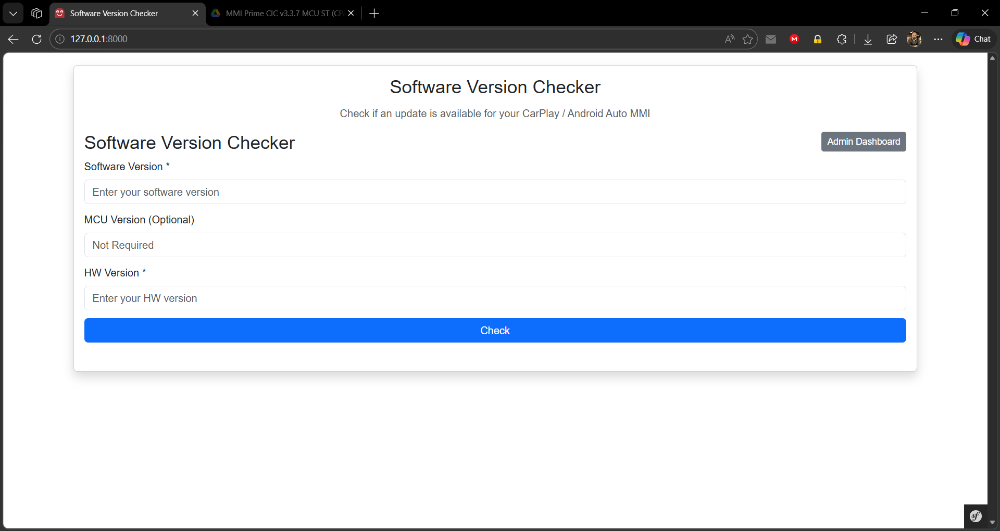
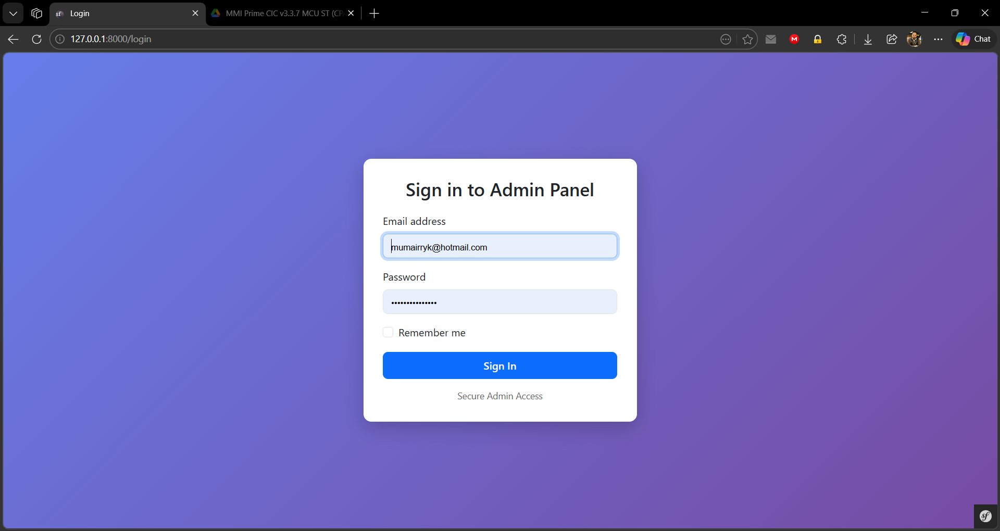
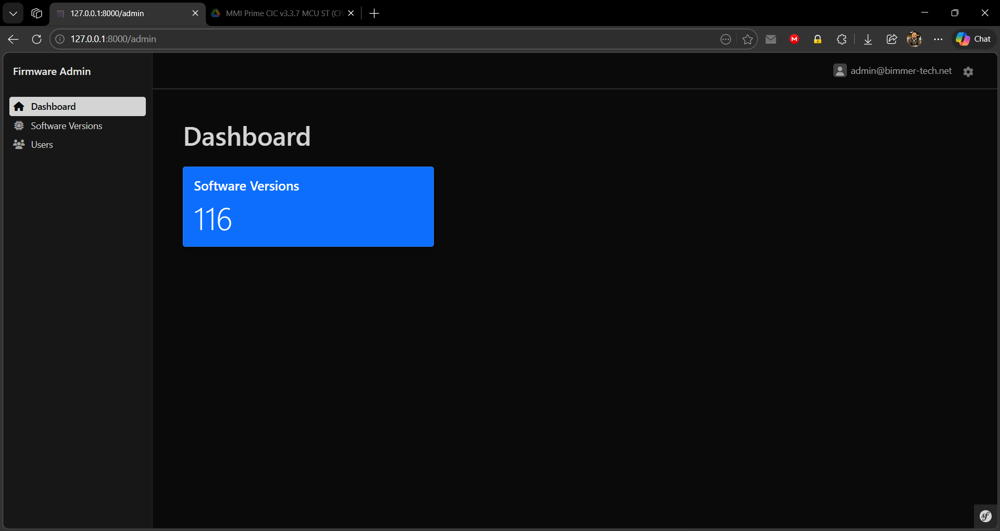

# Firmware Software Management System

A Symfony-based system for managing and distributing firmware updates for CarPlay / Android Auto MMI devices.

---


## Features

- ✅ Check correct firmware based on device version
- ✅ Download correct ST / GD firmware
- ✅ Admin panel to manage software versions
- ✅ Dashboard with statistics
- ✅ Import firmware from JSON file
- ✅ Prevent incorrect firmware installation

## Tech Stack

| Component | Version |
|-----------|---------|
| **Backend** | PHP 8.2+ with Symfony 6/7 |
| **Database** | MySQL 8+ |
| **Frontend** | Vue (CDN) + Bootstrap |
| **Admin Panel** | EasyAdmin 5 |

## Installation

### 1. Clone Repository

```bash
git clone https://github.com/mumairryk/firmware-app.git
cd firmware-app
```

### 2. Install Dependencies

```bash
composer install
```

### 3. Configure Environment

Update `.env` file:

```env
DATABASE_URL="mysql://root:@127.0.0.1:3306/firmware_db"
```

### 4. Setup Database

```bash
php bin/console doctrine:database:create
php bin/console doctrine:migrations:migrate
```

### 5. Run Application

**Option A: Using Symfony CLI**
```bash
symfony server:start
```

**Option B: Using PHP Built-in Server**
```bash
php -S 127.0.0.1:8000 -t public
```

## Admin Panel

**URL:** `http://localhost:8000/login`

### Default Credentials

| Field | Value                 |
|-------|-----------------------|
| **Email** | admin@bimmer-tech.net |
| **Password** | Admin123!             |

> ⚠️ **Important:** Change credentials after first login.

### Admin Features

- Manage Software Versions (CRUD operations)
- Manage Users
- Dashboard with statistics
- Import firmware data

## Import Software Versions

**JSON File Location:**
```
public/assets/softwareversion.json
```

**Import Command:**
```bash
php bin/console app:import-software
```

**User Create Command:**
```bash
php bin/console app:create-user
```

## Public Software Checker

**URL:** `http://localhost:8000/`

## Sample Inputs

### Valid Examples

**Standard ST Device**
- Version: `3.1.1.2.mmi.c`
- HW Version: `CPAA_2021.10.05`

**Standard GD Device**
- Version: `3.3.7`
- HW Version: `CPAA_G_2022.05.10`

**LCI CIC**
- Version: `3.1.1.4.mmi.c`
- HW Version: `B_C_2020.12.01`

**LCI NBT**
- Version: `3.4.4`
- HW Version: `B_N_G_2021.07.15`

**LCI EVO**
- Version: `3.4.4`
- HW Version: `B_E_G_2022.03.20`

### Invalid Example

- Version: `3.3.7`
- HW Version: `XYZ_123`

## API Endpoint

### Request

**Endpoint:** `POST /api2/carplay/software/version`

**Body:**
```json
{
  "version": "3.3.7",
  "hwVersion": "CPAA_G_2022.05.10",
  "mcuVersion": ""
}
```

### Response

```json
{
  "versionExist": true,
  "msg": "The latest version of software is v3.3.7",
  "link": "https://example.com",
  "st": "",
  "gd": "https://example.com/gd"
}
```

## Project Structure

```
src/
├── Controller/
│   ├── Admin/
│   ├── Api/
│   └── PublicController.php
├── Entity/
└── Command/
templates/
├── admin/
└── public/
public/
└── assets/softwareversion.json
```

## Important Notes

> ⚠️ **Critical:** Always enter correct HW & Version values. Wrong firmware may damage device!

- ✓ Only one version should be marked as latest
- 🔒 Admin access should be properly restricted
- Always validate input before deployment

## Future Improvements

- [ ] Upload JSON via Admin Panel
- [ ] Role-based access control
- [ ] Version validation UI
- [ ] Auto-sync firmware updates

## License

This project is licensed under the MIT License.

## Author

Developer: Muhammad Umair
Email: mumairryk@hotmail.com

## Screen Shots

### 🌐 Public Software Checker

### 🛠️ Admin Login

### 🛠️ Admin Dashboard

